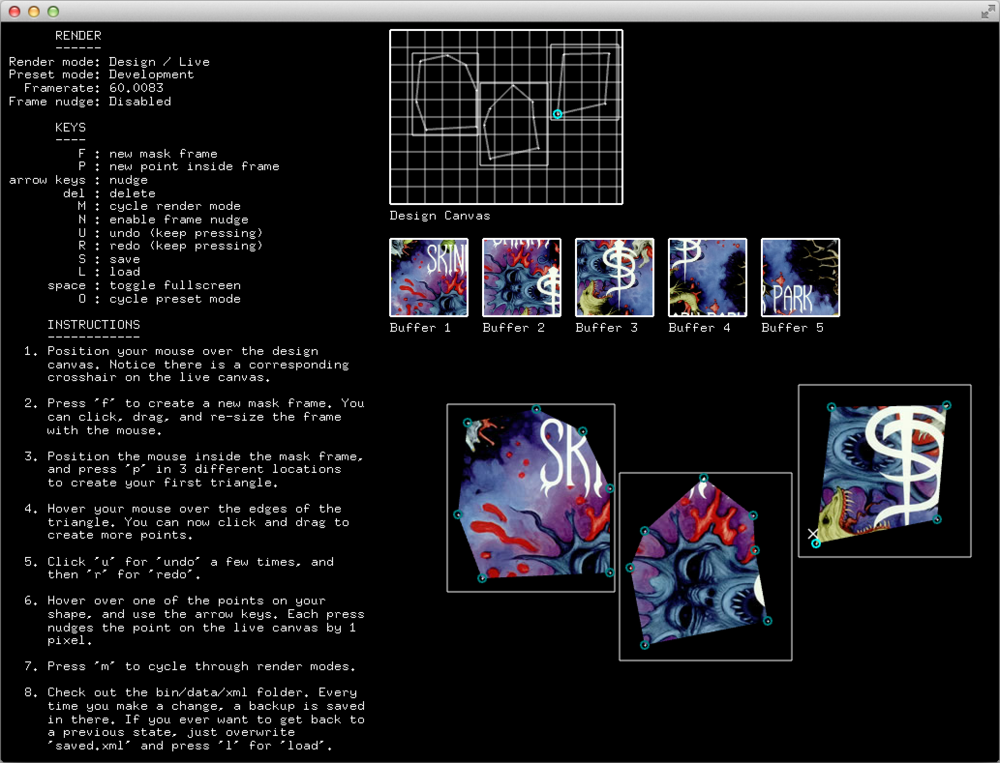

ofxProjectionMask
=================
ofxProjectionMask is an addon allowing you to mask projected light over real-world objects, from anything you draw in [openFrameworks](http://openframeworks.cc/).



Unlike projection mapping, this is not about creating the illusion that a light surface is 'mapped onto' a physical object; instead this addon simply prevents the light from 'bleeding' outside of the mask.

In other words, this addon separates out the [masking from the mapping](http://jahya.net/blog/projection-masking-not-projection), and focuses on the former rather than the latter.

Why?
----
Sometimes you [don't want to map, you just want to mask](http://jahya.net/blog/?2014-10-projection-masking-not-projection). Sometimes you want the light to 'drape' over an object at it's original rendered resolution. Sometimes you want to transform the media in a way unrelated to it's masking. This addon is for those occasions.

[](https://vimeo.com/109387735)

Also, there is a difference in emphasis here. This isn't about 'creating an illusion', this is about experimenting with projected media in the form of light. From this perspective, things don't have to match up in the way we expect them to in the real world - in fact it's better if they don't.

However, you do a have a set of options for how you would like the light to be shaped over the object, including homography and stretch. These options are explained below.

How does it work?
-----------------
Use the design UI (illustrated above) to carve out shapes at runtime. The UI will be fed by patterns you draw patterns into the addon like this:

```cpp
ofxProjectionMask designer;
ofxLayerMask *pattern1, *pattern2;

void ofApp::setup(){
    designer.setup();
}

void ofApp::update(){
    pattern1->begin();
    {
        //Draw a pattern here
    }
    pattern1->end();

    pattern2->begin();
    {
        //Draw another pattern
    }
    pattern2->end();
}

void ofApp::draw(){
    designer.draw();
}
```

You can choose from three drawing modes, which apply to the live canvas and change how your pattern is rendered.

```cpp
void ofApp::setup(){
    designer.setup(DO_NOT_STRETCH);
    //or
    designer.setup(STRETCH_TO_MASKFRAME);
    //or
    designer.setup(HOMOGRAPHY);
}
```

The drawing modes can only be set on `setup()` and apply to all patterns in the `ofxProjectionMask` instance. Each option affects how patterns are rendered:

- ### DO_NOT_STRETCH
  Draw the pattern exactly as specified, pixel-perfect to how it was drawn into the pattern buffer

- ### STRETCH_TO_MASKFRAME
  Stretch the given pattern so that it matches the boundaries of the 'mask frame' which contains it - you will learn about mask frames when you launch the UI

- ### HOMOGRAPHY
  Stretch the pattern so that it matches four arbitrary points within a mask frame. This is the closest we get to projection *mapping*, this essentially allows you to 'pre-warp' your pattern to match a rectangular target surface

  Note: HOMOGRAPHY mode only works when you have exactly 4 mask points inside your mask frame. If you have more than 4 then it falls back to DO_NOT_STRETCH

Check out the `ofApp.cpp` file for a full set of instructions and examples.

Can I run this fullscreen and with a projector?
-----------------------------------------------
Of course! That's what this is all about. Check out `ofApp.cpp` for full instructions.

Versions
--------
- 0.3.0
  - Switches rendering from ofxTriangle to ofxLayerMask
  - Adds support for homography and stretching to mask frames
  - Simplifies API for drawing patterns
  - Moves example patterns to `ofApp.cpp` to demonstrate
- 0.2.0
  - New screen management with ofxSecondWindow
  - Splits XML storage locations based on preset mode
  - Drops support for cycling between 'development' and 'production' mode presets at runtime. Now you have to select one mode or another before compiling, as described in `ofApp.cpp`
- 0.1.0 Initial release

Project dependencies
--------------------
- [ofxLayerMask](https://github.com/microcosm/ofxLayerMask) to mask patterns based on the points you select
- [ofxSecondWindow](https://github.com/genekogan/ofxSecondWindow) to allow for a dualscreen setup with a projector
- [ofxXmlSettings](http://www.openframeworks.cc/documentation/ofxXmlSettings/ofxXmlSettings.html) to store masks as you draw them - it's part of the openFrameworks core
- Tested against [openFrameworks 0.8.4](http://openframeworks.cc/download/)

With thanks
-----------
This codebase was created with support from [I-Park Foundation](http://www.i-park.org/) and the [Contemporary Artist Center](http://www.cactroy.org/).
